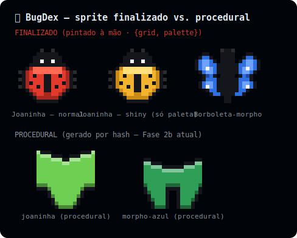

# BugDex — Nota de design: sprites autorais (fase de arte futura)

- **Data:** 2026-06-22
- **Status:** Nota exploratória (não é plano de implementação ainda)
- **Contexto:** Fase 2b (`render-embed`) entregou o renderer SVG consumindo sprites no formato `{ grid, palette }`, alimentados por um **gerador procedural**. Esta nota registra como trocar a fonte por **arte real** sem reescrever o motor.

---

## A sacada central

Um sprite "finalizado" é só um **`{ grid, palette }`** — exatamente o que `buildSprite()` já produz. O renderer (`spriteToRects()`) é **agnóstico à fonte** dos dados. Logo, dá pra elevar a qualidade da arte **sem tocar** em renderer, layout, CLI ou no embed: basta passar a alimentar grids feitos por artista/IA em vez dos procedurais.

A imagem abaixo foi gerada com o **mesmo** `spriteToRects()` da Fase 2b — a única diferença é que os sprites de cima foram **pintados à mão** (mapa de texto) e os de baixo vêm do `buildSprite()` procedural:



Observações que a imagem prova:
- **Reconhecibilidade:** o procedural é uma criatura abstrata e simétrica; o finalizado é uma joaninha/borboleta de verdade. Esse é o teto de qualidade-alvo (estilo sprite clássico).
- **Morph = recolorir:** a "joaninha shiny" é a **mesma grade** com a paleta trocada. O sistema de morph já funciona sobre arte real, igual funciona sobre o procedural.

## Esboço do registro de sprites autorais

A fase de arte introduz um **registro** `spriteKey → AuthoredSprite` e um seletor que cai no procedural quando ainda não há arte para aquela combinação:

```ts
// embed/authored.ts  (esboço — não implementado)
import type { Sprite } from './sprite.js';
import type { MetamorphosisStage } from '../domain/types.js';

/** Arte autoral indexada por espécie e (opcionalmente) estágio. */
interface AuthoredSprite {
  /** grade base; -1 vazio, e índices na paleta de cores. */
  grid: number[][];
  /** paleta-base (morph é aplicado por cima, como hoje). */
  palette: string[];
}

// Por enquanto: por spriteKey (adulto). Estágios extras entram quando a arte existir.
const REGISTRY: Record<string, Partial<Record<MetamorphosisStage, AuthoredSprite>>> = {
  // joaninha: { adulto: { grid: [...], palette: [...] } },
};
```

```ts
// seletor: usa arte autoral se houver, senão procedural (fallback gracioso)
export function spriteFor(spriteKey, stage, morph, biomeId): Sprite {
  const authored = REGISTRY[spriteKey]?.[stage];
  if (authored) return applyMorph(authored, morph);   // troca de paleta, como o procedural
  return buildSprite(spriteKey, stage, morph, biomeId); // fallback determinístico
}
```

`render.ts` passaria a chamar `spriteFor(...)` em vez de `buildSprite(...)` diretamente — mudança de uma linha. Tudo o mais (layout, escape, CLI, snapshot) fica intacto.

### Como produzir os grids autorais

Qualquer fonte que gere `{ grid, palette }` serve:
- **Mapa de texto (ASCII)** pintado à mão — foi como a imagem desta nota foi feita; ótimo para iterar rápido e revisar em diff.
- **Editor de pixel-art** (Aseprite, Piskel, LibreSprite) → exportar e converter para grade.
- **IA** gerando pixel-art → curadoria + conversão para grade.

### Tratamento de morph e estágio

- **Morph:** mesma estratégia de hoje — transforma a paleta-base (`shiny`/`albino`/`melanico`), não a forma. Já validado sobre arte real (joaninha shiny da imagem).
- **Estágio:** começar só com `adulto` autoral e deixar ovo/larva/pupa no procedural; preencher estágios conforme a arte for sendo feita. O fallback por estágio já cobre isso.

## Escopo & realidade

- O **encanamento está 100% pronto** (Fase 2b). Esta fase é majoritariamente **trabalho de arte**, não de código — exatamente o "verdadeiro trabalho" que o design geral marcou como o maior risco (§16).
- Sugestão de entrega incremental: registrar o tipo + o seletor com fallback, plugar **1–2 espécies finalizadas** de verdade, e ir preenchendo espécie por espécie sem pressa. Nenhuma espécie sem arte quebra nada — cai no procedural.

## Próximos passos (quando retomar)

1. Brainstorm/plano da fase de arte (registro + seletor + 1ª leva de sprites), ou
2. Antes disso, a fase `web-app` (Next.js + OAuth + rota `GET /{login}.svg`), que destrava colar o widget no README do GitHub de verdade.
